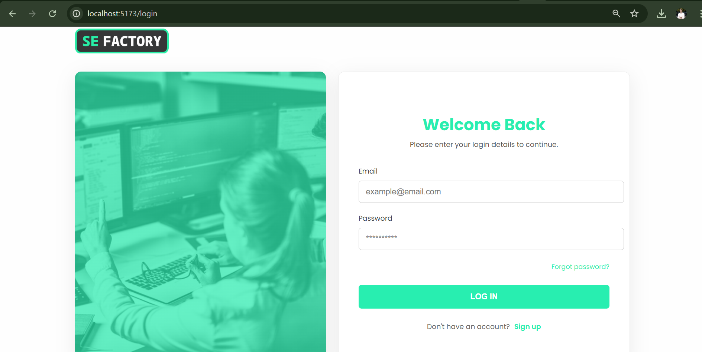
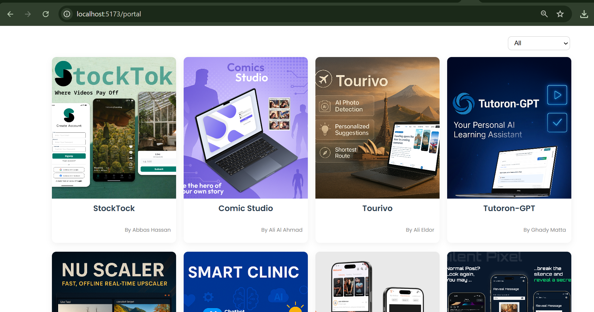
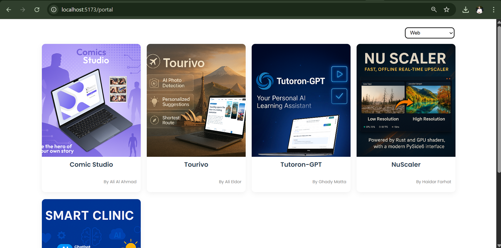

# Vue Student Portal

A student project showcase portal built with Vue 3 (frontend) and Node.js + TypeScript + MongoDB (backend). Includes login functionality, filtering, and a responsive layout.

---

## ✨ Features

- 🔐 Login system with JWT authentication  
- 🎯 Filter student cards by type (Web / Mobile / Both)  
- 📱 Responsive card layout (4 per row max)  
- ⚡ Clean architecture with separate features and composables  
- 🧪 MongoDB seeding for demo data  

---

## 🖼️ Preview

Here are some screenshots of the application:

| Login Page | Portal Page | Filtered Portal |
|:---:|:---:|:---:|
|  |  |  |

---

## 🚀 Getting Started

1. Clone the repository:

   ```bash
   git clone https://github.com/Yehia-Arja/Vue
   cd Vue
   ```

2. Install dependencies:

   **For frontend:**

   ```bash
   cd frontend
   npm install
   ```

   **For backend:**

   ```bash
   cd ../backend
   npm install
   ```

3. Setup MongoDB:

   - Download and install [MongoDB Community Edition](https://www.mongodb.com/try/download/community)
   - Make sure MongoDB is running on `mongodb://localhost:27017`

4. Create a `.env` file inside the `backend/` folder with these variables:

   ```ini
   MONGO_URI=mongodb://localhost:27017/vue-students
   PORT=5000
   JWT_SECRET=yourSuperSecret
   ```

5. Seed the database:

   ```bash
   cd backend
   npm run seed
   ```

6. Run the application:

   **Start backend:**

   ```bash
   npm run dev
   ```

   **Start frontend in another terminal:**

   ```bash
   cd ../frontend
   npm run dev
   ```

   Access the frontend at [http://localhost:5173](http://localhost:5173) and backend API at [http://localhost:5000](http://localhost:5000).

